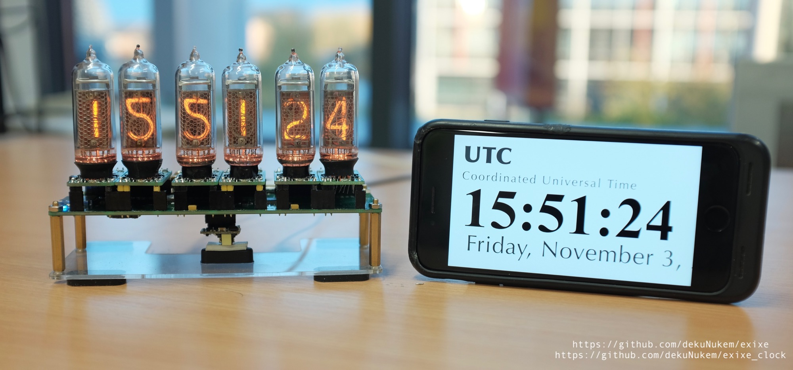
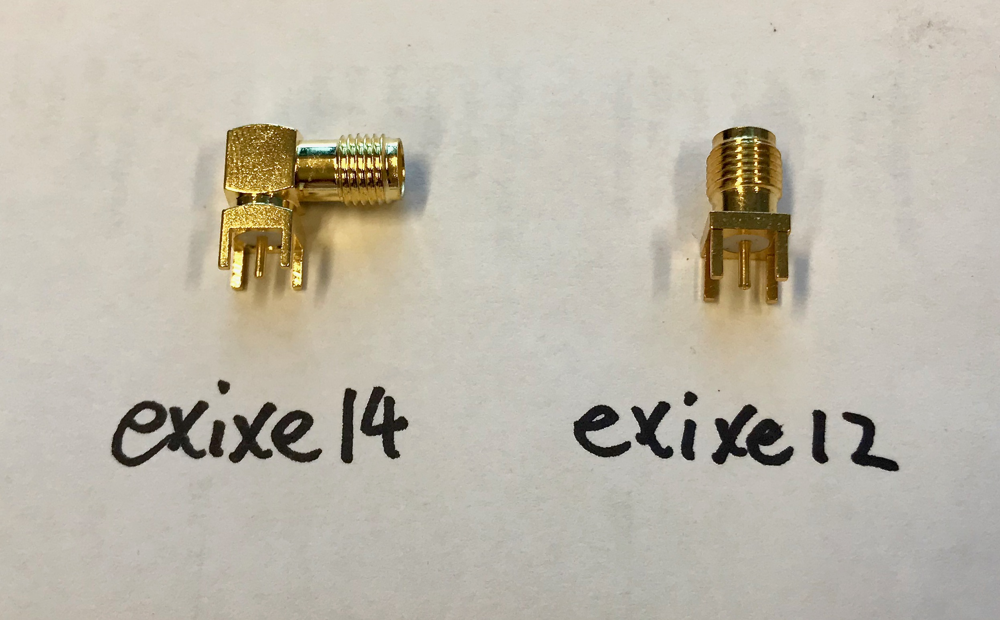

# exixe clock: nanosecond-precision GPS-disciplined Nixie tube clock

exixe clock is a GNSS-aided high precision Nixie tube clock.

With GPS fix acquired, displayed time would be within 60 **nanoseconds** of the atomic clocks onboard the satellites.

exixe clock makes use of the [exixe modules](https://github.com/dekuNukem/exixe), and works with both IN-14 and IN-12 tubes. It also comes with a wealth of sensors and interfaces on-board, allowing it to be hacked beyond just a timepiece.

## Video

Here's a short video of exixe clock in action with [exixe14 modules](https://github.com/dekuNukem/exixe) :

https://www.youtube.com/watch?v=r3d2alzgjKc

## Features

### Precision Timing

* 60ns with GPS fix
* less than 1 second per month drift without GPS fix
* Auto time acquisition
* Battery backup
* Customizable timezone

### Simple & modular construction

* Uses [exixe modules](https://github.com/dekuNukem/exixe)
* Works with both IN-12 and IN-14 tubes
* Single 5V supply from USB
* 350mA average consumption

### Versatile interfaces

* USB data transfer / firmware upload
* SD card slot
* Temperature sensor
* Light sensor
* UART extension header
* GNSS debug header
* 2 capacitive touch buttons
* 2 physical buttons
* GNSS fix indicator LED

## Rants about conventional Nixie clocks

I was looking through existing Nixie clock projects before starting my own, and I'm rather unconvinced with some trends that many have in common:

* Using through hole components

While there's technically nothing wrong, I feel that in this day and age using PTH looks bulky and unprofessional.

* 12V supply

I want my clock to be powered by a single USB cable, using a 12V powerbrick is both cumbersome and complicates the design.

* Fixed and multiplexed tubes

This is my biggest gripe. With soldered down tubes, it's almost impossible to replace if one breaks, or to repurpose them for other projects. And as Nixie tubes have been out of productions for 30 years, they should be conserved as much as possible.

And as a result of fixed tubes, they are almost always multiplexed. This requires obscure driver chips, complex to route and program, and because only one tube is on at any given time, perceived brightness is 1/6 of what it could be. To compensate, the tubes are often overdriven beyond their max allowed current, reducing their life time. Total mess all around.

* Questionable timekeeping

Let's not forget Nixie clock is first and foremost a clock, and it's useless if it's not good at keeping time. However this aspect almost looks like an afterthought in a lot of the existing Nixie clocks. On many of those time have to be manually entered, and kept with $3 RTC modules from alibaba that drifts 20 seconds a month. I want my clock to be as accurate as possible.

## Things done differently

In the end, I decided to keep the design as modular and as simple as possible. As a result, I designed the exixe driver modules first, then the clock itself later. 

You can read more about the [exixe modules here](https://github.com/dekuNukem/exixe), but in short, they are tiny and inexpensive Nixie tube drivers with hardware PWM on all digits and RGB backlight. Each module controls one tube, and uses SPI for communication.

Now that each tube has its own driver, multiplexing is no longer needed, and routing is down to only 3 SPI lines, and each tube can be replaced and repurposed simply by unplugging the module.

Next up is timing, instead of manually setting time and using built-in RTC, I decided to use GPS-based timekeeping. There are atomic clocks onboard each GPS satellites, and the precise UTC time can be calculated as part of the position fix. This way time can be automatically set and kept within 60ns of GPS time with position fix. Each digit update is triggered by the timepulse signal from the GNSS receiver, synced to the precise transition of each UTC second. And if antenna is disconnected, drift seems to be than 1 second per month from the observation of the one I made myself. A coin battery keeps time even when the clock itself is turned off.

A bunch of extra features was thrown in during the design process as well. I added a temperature sensor so the tubes can optionally display hour:minute:temp instead of hour:minute:second, a blue LED lights up when GPS fix is acquired, 2 capacitive touchpad was added for buttonless controls, a light sensor was added for automatic brightness adjustment, SD card slot was added for data logging, and UART header was added for debugging and expansion.

## User guide

### Setting time

Install a CR1220 coin battery in the holder, connect a GPS antenna and place it under clear sky, time will be automatically set and saved when a GPS fix is obtained. You might have to wait 2 or 3 minutes, but it's usually much faster. Wait until the GPSFIX LED is on for the most accuracy.

### Setting timezone

Unplug the clock, hold down B button then power it back on. The middle two tube will display the UTC offset. Use A and B button to set the offset to your timezone. For negative offsets a dot on the left tube will illuminate.

### 12/24 hour display

Unplug the clock, hold down A button then power it back on. The middle two tube will display either 12 or 24. Use A button to change it.

### Temperature display

Press either A or B button during normal operation to switch the display to temperature in the rightmost two tubes, press it again to switch back.

## Extensions and hacks

There are some extra components that's worth mentioning if you want to further develop upon this project.

* A UART header is situated to the left of the USB port, you can use it for communication or as 2 extra GPIOs for extensions. 

* The GPS header beside the antenna connector breaks out the TX, RX and timepulse of the GPS module, it's mainly for debugging purposes.

* There is a light sensor for automatic brightness adjustment. However found it annoying after implementing that feature so it's not used right now. Therefore you don't need to solder on a light sensor at all, but it's there if you need it.

* 2 capacitive touchpad buttons are available, they are designed according to the ST reference doc and connected to TSC channels of the STM32, I haven't found a use for them yet though.

* A DFU button is available, hold it down while plugging the clock into a computer puts the STM32 into USB DFU mode, so you can upload firmware through USB without needing a programmer.

* You can use the empty pad of unused components for more GPIOs.

## Parts and tips

* MCU is STM32F072C8T6
* Light sensor is TEMT6000
* Temperature sensor is DS18B20
* GNSS receiver is ublox M8Q (M7Q also works)
* High voltage module is [this one](https://www.ebay.co.uk/itm/DC-5V-12V-to-170V-DC-High-Voltage-NIXIE-Power-Supply-Module-PSU-NIXIE-TUBE-ERA/322511957768?hash=item4b1735ef08:g:ftQAAOSwYTVZmjZb)
* There are two headers for the HV module, use the one that has the correct pinout
* Undefine `USE_EXIXE_14` at the beginning of [my_tasks.c](firmware/Src/my_tasks.c) to use IN-12 tubes.

## Building one yourself

BOM is [here](resources/clock_bom.xlsx)

Making one yourself is fairly straightforward, just order the parts and solder them together. Couple of things to keep in mind though:

There are a couple of optional components that is not used in the current firmware, so you can leave them out if you want, they are highlighted in yellow in the BOM

The temperature sensor DS18B20 has a lot of fakes on the internet, if it's too cheap it's almost certainly fake. Best way is just order through a reputable source like mouser or digikey, it is also optional if you don't want to use this feature.

DO NOT solder the GPS module by hand, it would result in terrible reliability where the GPS module would randomly stop working. Always use paste and reflow.

The PCB works with both exixe12 and exixe14 modules, the only different component is the SMA antenna connector. On clock using exixe14 modules, the right-angle SMA connector is used, while on clock using exixe12 module, a straight SMA connector is used instead. This allows the SMA receptacle point to the back of the clock in both cases.

Front and back plate are need with exixe12 clock to support the PCB inbetween, they are just regular laser cut clear acrylic plates, your local hackerspace should have a laser cutter. The plate files are in the `resources` folder.

You can go without plates with exixe14 clock, although I still recommend getting one for added rigidness. You only need one plate in this case.